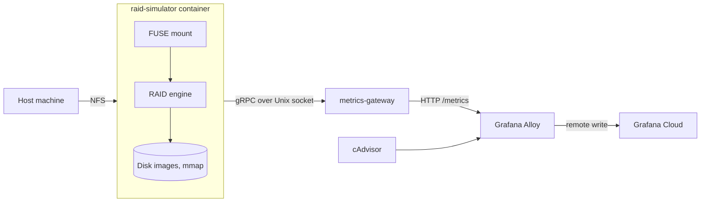

# Stripe Slinger

A user-space RAID 0, 1 and 3 simulator that mounts as a real filesystem, with per-operation telemetry streamed over gRPC to a Prometheus gateway.

- [Overview](#overview)
- [Scope](#scope)
- [Features](#features)
- [Tech stack](#tech-stack)
- [Architecture](#architecture)
- [Getting started](#getting-started)
- [Usage](#usage)
- [Monitoring](#monitoring)
- [Testing](#testing)
- [Project structure](#project-structure)
- [License](#license)
- [Authors](#authors)

## Overview

Stripe Slinger simulates a RAID array entirely in user space and presents it as a filesystem you can mount and use. You copy files onto it, fail a disk by writing a number into a control file, and watch the array degrade and rebuild in a Grafana dashboard. Nothing runs in the kernel and no physical disk is involved, so a failure scenario costs one command and no hardware.

It was built as a university coursework project in 2025. The purpose was to make RAID behavior observable: the parity math, the reconstruction of a lost disk, and the cost of a rebuild are all things that are easy to describe and hard to watch happening.

## Scope

The array is a simulation. Each virtual disk is a preallocated file mapped into memory, and the whole engine runs as an ordinary user-space process behind FUSE. It is not a block-level driver and it is not meant to store data you care about.

The filesystem on top of the array is deliberately minimal. It has one flat root directory with no subdirectories, a fixed table of 128 files, names up to 64 bytes, and files that grow only at the end of the allocated region. It exists to give the array a realistic workload, not to compete with a general-purpose filesystem.

Throughput is a small fraction of the medium underneath. The default stripe block is four bytes, so a three-disk parity array carries eight logical bytes per stripe, and every write runs a full read-modify-write of the whole stripe across every disk with no caching in the path.

RAID levels 0, 1 and 3 are implemented. Levels 5 and 6 are not.

## Features

- RAID 0, 1 and 3 layouts behind one shared abstraction, selectable at mount time.
- Arrays of one to eight disks with a configurable disk size. Each array width is a separately specialized build of the engine, with disk counts resolved at compile time.
- A mountable filesystem supporting create, lookup, read, write, truncate, delete, directory listing, attribute queries and filesystem statistics.
- Failure injection from inside the mounted filesystem. Writing a disk number into `.raidctl` fails that disk, and three named commands replace it, rebuild it, or run the whole fail-replace-rebuild cycle.
- Live array status read back from the same control file, showing each disk as healthy, awaiting rebuild, or failed.
- Automatic recovery on read. A mirror rebuilds from a surviving copy and a parity array reconstructs a single lost disk, both as a side effect of ordinary reads.
- Scrubbing. The mirror layout takes a majority vote across copies and rewrites the drives that disagree. The parity layout recomputes parity and rewrites it only when the stored value differs.
- Rebuild bounded by written data rather than by disk size, with progress published while it runs.
- NFS re-export, so a host machine mounts the simulated array as an ordinary network share.
- Non-blocking telemetry. Every disk, array and filesystem operation is timed and batched into a bounded queue that drops on overflow rather than slowing the storage path.
- A metrics gateway exposing 33 metric families over HTTP, with an authenticated gRPC ingest stream, per-sample validation, and optional rate limiting.
- A synthetic load generator for exercising the monitoring stack without mounting anything.

## Tech stack

**Languages.** Rust 2024 edition for the storage engine, Go 1.25 for the metrics gateway.

**Storage engine.** FUSE bindings for the kernel filesystem interface, a memory-mapping library for the virtual disks, Tokio for the asynchronous telemetry pipeline, Tonic and Prost for gRPC and Protocol Buffers, Clap for the command line, and Tracing for structured logs.

**Metrics gateway.** The Prometheus Go client, gRPC, Protocol Buffers, and a token-bucket rate limiter.

**Protocols.** Protocol Buffers over gRPC on a Unix domain socket. NFS for host access. The Prometheus text exposition format over HTTP.

**Infrastructure.** Docker and Docker Compose, GitLab CI with purpose-built runtime images, Terraform against the Grafana provider, Grafana Alloy, hosted Prometheus and Grafana, and cAdvisor for container resource metrics.

## Architecture

Two application services run side by side in one Compose stack. They never use the network to talk to each other. Instead they share a Docker volume holding a Unix domain socket, and a one-shot init container sets that directory's ownership and permissions before either service starts, so the gateway can create the socket while running as a non-root user in an image with no shell.



Inside the container, `raid-cli` mounts the FUSE filesystem and an NFS server re-exports that mount point, which is how the host reaches it.

The engine itself is a Cargo workspace of two crates with a one-way dependency. `raid-rs` holds the RAID logic and depends on nothing but an error type and a memory-mapping library. It has no knowledge of FUSE, gRPC or Protocol Buffers. `raid-cli` is the adapter: it implements the kernel filesystem interface, provides the command line, and carries the telemetry pipeline. Telemetry crosses the boundary through a port. `raid-rs` defines a recording interface and a slot for one global implementation, and when nothing is installed there the measurement code does not run at all.

`raid-rs` is layered in three parts. A stripe layer holds one stripe in memory as an array of fixed-size blocks, with one implementation per RAID level. A retention layer maps each virtual disk onto a preallocated file, groups disks into an array, and combines an array with a stripe layout into a volume offering byte-level reads and writes. A geometry helper converts a logical byte offset into a stripe index and an offset within that stripe using division and modulo on fixed constants, with checked arithmetic on both conversions.

On disk, the filesystem is an eight-byte signature, a format version, a pointer to the first free byte, and a table of 128 entries of 88 bytes each. An entry holds a use flag, a byte offset, a size and a name. When the header does not parse, the mount path treats the volume as unformatted and writes a fresh header and an empty table.

## Getting started

Requirements: Docker with Compose, and a Linux or macOS host. The Makefile uses `sudo` to mount and unmount the NFS share, and it resolves paths through `git rev-parse`, so run it from inside a clone of the repository.

Copy the environment template and fill it in:

```bash
cp .env.example .env
```

| Variable | Purpose |
| --- | --- |
| `GRAFANA_CLOUD_PROM_URL` | Remote write endpoint for hosted Prometheus |
| `GRAFANA_CLOUD_PROM_USERNAME` | Prometheus user ID from Grafana Cloud |
| `GRAFANA_CLOUD_PROM_PASSWORD` | API token with the `metrics:write` scope |
| `GRPC_AUTH_TOKEN` | Shared secret authenticating the metrics stream. Both services must use the same value |
| `RAID_LEVEL` | Which layout to simulate: `raid0`, `raid1` or `raid3` |
| `DISK_SIZE` | Virtual disk size in bytes |
| `METRICS_SOCKET_PATH` | Path to the metrics socket inside the containers |

Then start everything:

```bash
make up
```

`make up` stops any previous run, creates the storage directories, brings the containers up, waits for the NFS port, mounts the share and initializes the array. Other targets:

| Target | What it does |
| --- | --- |
| `make status` | Show the mount state and container status |
| `make logs` | Follow container logs |
| `make rebuild` | Rebuild the images and restart the environment |
| `make down` | Unmount and stop everything |
| `make clean` | Stop, then wipe the simulated disks, mounted data and collector state |
| `make docs` | Build and open the Rust and Go API documentation |

Run `make help` for the full list.

## Usage

The array is mounted at `storage/raid-data-host`. Use it like any other directory. Control it through the `.raidctl` file in its root:

```bash
echo 1 > .raidctl          # fail disk 1
echo "replace 1" > .raidctl # replace disk 1 and rebuild it
echo "rebuild 1" > .raidctl # rebuild disk 1
echo "swap 1" > .raidctl    # fail, replace and rebuild disk 1
cat .raidctl                # command help and live disk status
```


## Monitoring

Grafana Alloy scrapes the gateway and cAdvisor every five seconds and remote-writes to hosted Prometheus. The cAdvisor stream is filtered down to the simulator container and six metric names.

Four dashboards cover 27 panels: a system overview, a physical disk view, a RAID engine view and a filesystem interface view.

Overview, with a degraded array and two failed disks:


Physical disk layer, with per-disk IOPS, queue depth and p95 latency:


Filesystem interface, with operation rates, throughput and end-to-end latency percentiles:


RAID engine, with logical IOPS and throughput:


Four panels on the RAID engine dashboard are fed only by the synthetic generator. RAID 1 read distribution, RAID 3 parity reads, RAID 3 parity writes and RAID 3 partial stripe writes exist in the data contract, but the live engine does not populate them, so they stay empty when you drive the array through the mount.

The Grafana side is provisioned as code. `provisioning/terraform` defines the alert folder, an email contact point, a notification policy and two alert rules, and it loads every dashboard file in `observability/grafana/dashboards`. The alerts fire on a degraded array after one minute and on a p95 write latency above half a second sustained for three minutes. Copy `secrets.auto.tfvars.example` and fill in the Grafana URL, a service account token, the Prometheus data source name and an alert email address.

## Testing

113 Rust test functions and 28 Go test functions. The Rust suite covers XOR algebra, round trips through all three layouts, mirror and parity recovery, geometry arithmetic including both overflow cases, disk range clamping, header parse rejections, backoff behavior and the shape of an emitted metrics batch. The Go suite covers ingest validation and accounting, both auth interceptors, the rate limiters, config loading, a full gRPC-over-socket server lifecycle and the HTTP endpoints.

CI runs them as:

```bash
cargo llvm-cov nextest --manifest-path services/raid-simulator/Cargo.toml --workspace --all-features
go test ./... -coverprofile=coverage.out.tmp -covermode=atomic
```

The pipeline also runs formatting checks, Clippy with the correctness and suspicious lint groups denied, `go vet`, dependency vulnerability audits for both languages, and a 50 percent line coverage floor enforced on the main branch and on merge requests targeting it. Generated Protocol Buffers code is filtered out of the coverage profile before it is measured.

## Project structure

```
api/proto/            Protocol Buffers contract for the metrics stream
deploy/               Compose stack and the socket init script
docs/screenshots/     Dashboard and terminal captures
observability/        Alloy collector config and four Grafana dashboards
provisioning/         Terraform for Grafana folders, dashboards and alerts
services/
  raid-simulator/     Rust workspace: raid-rs (RAID logic), raid-cli (FUSE adapter)
  metrics-gateway/    Go service: gRPC ingest, Prometheus registry, HTTP endpoints
.gitlab/ci/           Pipeline jobs, scripts and custom CI runtime images
```

## License

This project is licensed under the [MIT License](LICENSE).

## Authors

**Kamil Fudala**

- [GitHub](https://github.com/FreakyF)
- [LinkedIn](https://www.linkedin.com/in/kamil-fudala/)

**Jan Chojnacki**

- [GitHub](https://github.com/Jan-Chojnacki)
- [LinkedIn](https://www.linkedin.com/in/jan-chojnacki-772b0530a/)

**Jakub Babiarski**

- [GitHub](https://github.com/JakubKross)
- [LinkedIn](https://www.linkedin.com/in/jakub-babiarski-751611304/)
