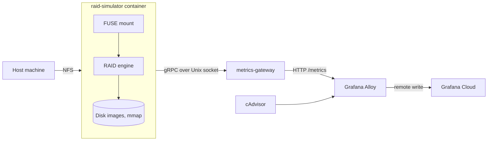

# Stripe Slinger

A user-space simulator of RAID 0, 1 and 3 arrays that mounts as an ordinary filesystem, with every disk, array and filesystem operation timed and streamed over gRPC to a Prometheus gateway, plus the dashboards and alerts used to watch it.


## Overview

RAID behaviour is easy to describe and hard to watch. Stripe Slinger simulates an array entirely in user space and presents it as a mountable filesystem, so the parity math, the reconstruction of a lost disk and the cost of a rebuild happen somewhere they can be observed. Each virtual disk is a preallocated file mapped into memory. A disk number written into a control file inside the mount fails that disk, the array degrades and rebuilds, and the sequence reaches Grafana on the next scrape. Nothing runs in the kernel and no hardware is involved, so a failure scenario costs one command.

Built as a university coursework project over one semester. Complete, with no further development planned.

## Scope

Stripe Slinger stripes a fixed set of memory-mapped files, exposes them through FUSE, and re-exports that mount over NFS so a host machine can use it. It is not a block-level driver and not a place for data that matters.

The filesystem on top is minimal: one flat root directory, a fixed table of 128 files, names up to 64 bytes, and files that grow only at the end of the allocated region. It exists to give the array a realistic workload.

RAID 0, 1 and 3 are implemented. A parity array reconstructs one missing member per stripe, and with two disks of three gone the stripe reads back as zeros rather than an error. Mirror reads always come from the first drive.

The default stripe block is four bytes, so a three-disk parity array carries eight logical bytes per stripe, and every write runs a full read-modify-write of that stripe across every disk with nothing caching in between. Cost follows the stripe geometry rather than the medium underneath. This is a teaching instrument, not a storage system.

## Features

- RAID 0, 1 and 3 behind one stripe abstraction, selected at mount time
- One to eight disks with a configurable disk size, each width a separately monomorphised build of the engine, with a single disk accepted only for RAID 0
- A mountable filesystem covering create, lookup, read, write, truncate, delete, listing, attribute queries and filesystem statistics
- Failure injection from inside the mount, by writing a disk number or one of `replace`, `rebuild` and `swap` into the `.raidctl` control file
- Live per-disk state read back from the same file, as healthy, awaiting rebuild or failed
- Recovery as a side effect of ordinary reads, a mirror from a surviving copy and a parity array from the remaining members
- Scrubbing, by majority vote across mirror copies and by parity recomputation on the parity layout
- Rebuild bounded by written data rather than by disk size, with progress published while it runs
- NFS re-export, so a host machine mounts the array as an ordinary network share
- Non-blocking telemetry, timed and batched into a bounded queue that drops on overflow rather than slowing the storage path, with the client reconnecting on backoff from 250 ms to a 10 second ceiling
- A gateway exposing 33 metric families over HTTP, ingesting over gRPC on a Unix socket with per-sample validation, an optional shared token and an optional rate limit
- A synthetic load generator for exercising the monitoring stack without mounting anything

## Tech stack

Rust, edition 2024, for the storage engine and Go 1.25 for the gateway. Both ship as container images: the engine on a Debian slim runtime carrying fuse3 and an NFS server, the gateway on a distroless static image running as a non-root user.

| Area | Libraries |
|---|---|
| Storage engine | `fuser` for the kernel filesystem interface, `memmap2` for the virtual disks, `tokio` and `tokio-stream` for the telemetry pipeline, `tonic` and `prost` for gRPC, `clap`, `tracing` |
| Metrics gateway | `client_golang` for the registry, `grpc-go`, `protobuf`, `golang.org/x/time/rate` for the limiter |
| Protocols | Protocol Buffers over gRPC on a Unix domain socket, NFS for host access, the Prometheus text format over HTTP |
| Deployment | Docker and Docker Compose, five services in one stack |
| Observability | Grafana Alloy, hosted Prometheus and Grafana, cAdvisor, Terraform against the Grafana provider |
| Testing and CI | The standard Rust and Go test harnesses, GitLab CI on purpose-built runtime images, `cargo nextest` with `llvm-cov`, `cargo audit`, `govulncheck` |

Both images are built from source by the pipeline and pushed to the project's container registry.

## Architecture

Two application services in a stack of five, talking over a Unix domain socket on a shared volume rather than over the network.

| Component | Responsibility |
|---|---|
| `raid-rs` | Bit buffers and parity, stripe layouts, disks, arrays, volumes. No knowledge of FUSE, gRPC or Protocol Buffers |
| `raid-cli` | The adapter: FUSE filesystem, command line, telemetry pipeline |
| `metrics-gateway` | gRPC ingest over the socket, per-sample validation, a private Prometheus registry, `/metrics` and `/healthz` |
| `init-sockets` | A one-shot container fixing ownership and mode on the socket directory before either service starts |
| Alloy | Scrapes the gateway and cAdvisor and remote-writes to hosted Prometheus |
| cAdvisor | Container CPU, memory and restart counts for the simulator container |



**Two processes, one socket.** The socket lives on a named volume, not on the network, and the gateway runs as a non-root user in an image with no shell, so it cannot prepare its own directory. A one-shot init container sets the ownership and mode first. Inside the simulator container, `raid-cli` mounts the FUSE filesystem and an NFS server re-exports that mount point, which is how the host reaches it.

**Inside the engine.** The Rust side is a workspace of two crates with a one-way dependency. `raid-rs` depends on nothing but an error type and a memory-mapping library. A stripe layer holds one stripe as an array of fixed-size blocks with one implementation per RAID level, and a retention layer maps each disk onto a preallocated file, groups disks into an array, and combines an array with a layout into a volume with byte-level reads and writes. A geometry helper turns a logical byte offset into a stripe index and an offset inside it, with checked arithmetic on both conversions. Telemetry crosses the crate boundary through a port. `raid-rs` defines a recording interface and a slot for one global implementation, and when nothing is installed there the measurement code does not run at all.

**On-disk format.** An eight-byte signature, a format version, a pointer to the first free byte and a table of 128 entries of 88 bytes. An entry holds a use flag, a byte offset, a size and a name. Files are bump-allocated from the first free byte, and only the file at the end of the arena may grow. A header that does not parse is treated as unformatted, and the mount writes a fresh one.

**Telemetry path.** The FUSE mount call blocks, so the whole asynchronous pipeline runs on a dedicated thread with its own multi-threaded runtime. Emitters hand samples to a bounded channel and never wait on it. A ticker drains the channel, groups one tick into a batch, attaches the latest disk and array state and a process sample, and skips the send when the tick produced nothing. Batches lost to a full queue are counted. The connection loop backs off and reconnects on its own, and at shutdown the stream closes and the last request is awaited under a grace timeout.

## Testing

113 Rust test functions and 28 Go test functions. The pipeline runs each language's jobs only when that language's files change.

| Area | What they check |
|---|---|
| Parity and layouts | XOR algebra on the bit buffer, round trips through all three layouts, mirror restore and majority-vote scrub, RAID 3 reconstruction of every data disk |
| Volume and geometry | Offset arithmetic including both overflow cases, read and write clamping on the disk, array persistence, multi-stripe round trips with a partial overwrite |
| Filesystem and CLI | Header parse rejections, name validation, entry serialisation and truncation, directory listing, inode resolution, CLI defaults and environment overrides |
| Telemetry client | Backoff doubling and jitter, socket connect failure, the shape of an emitted batch |
| Gateway | Ingest validation and accounting, both auth interceptors, the rate interceptors, config loading, a full gRPC-over-socket lifecycle, the HTTP endpoints |

Beyond the tests, the pipeline runs formatting checks, Clippy with the correctness and suspicious groups denied, `go vet`, a vulnerability audit for each language, and a 50 percent line coverage floor on the main branch and on merge requests targeting it. Generated Protocol Buffers code is filtered out of the coverage profile first. The two CI runtime images are content-addressed, so a build that would produce an existing tag is skipped.

## Monitoring

A simulated failure is only worth staging if it is visible, so the repository carries the collector, the dashboards and the alerts as well as the program.

Grafana Alloy scrapes the gateway and cAdvisor every five seconds and remote-writes to hosted Prometheus, with the cAdvisor stream relabelled down to the simulator container and six metric names. Four dashboards cover 27 panels: a system overview, a physical disk view, a RAID engine view and a filesystem interface view.


`provisioning/terraform` defines the alert folder, an email contact point, a notification policy and two alert rules, and loads every dashboard file in `observability/grafana/dashboards`. The alerts fire on a degraded array after one minute and on a p95 write latency above half a second sustained for three minutes.

Two gaps apply. Four panels on the RAID engine dashboard, covering RAID 1 read distribution, RAID 3 parity reads and writes, and partial stripe writes, exist in the data contract but are filled only by the synthetic generator, so they stay empty when the array is driven through the mount. A failed disk also drops out of the per-disk views, because the engine reports a negative queue depth for a missing disk and the gateway rejects negative values at ingest. The degraded state the alert reads is a RAID-level metric rather than a per-disk one.

## Project structure

```
services/       raid-simulator (Rust: raid-rs, raid-cli), metrics-gateway (Go)
api/proto/      Protocol Buffers contract for the metrics stream
deploy/         Compose stack and the socket init script
observability/  Alloy configuration and four Grafana dashboards
provisioning/   Terraform for the Grafana folder, dashboards and alerts
.gitlab/ci/     Pipeline jobs, scripts and custom runtime images
docs/           Screenshots
```

## Authors

**Kamil Fudala**

- [GitHub](https://github.com/FreakyF)
- [LinkedIn](https://www.linkedin.com/in/kamil-fudala/)

**Jan Chojnacki**

- [GitHub](https://github.com/Jan-Chojnacki)
- [LinkedIn](https://www.linkedin.com/in/jan-chojnacki-dev/)

**Jakub Babiarski**

- [GitHub](https://github.com/JakubKross)
- [LinkedIn](https://www.linkedin.com/in/jakub-babiarski-751611304/)
