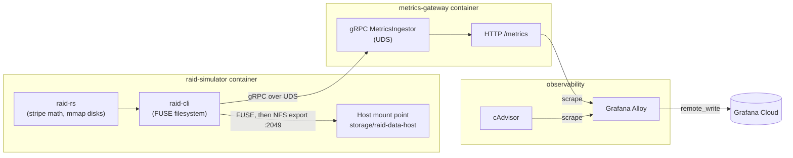
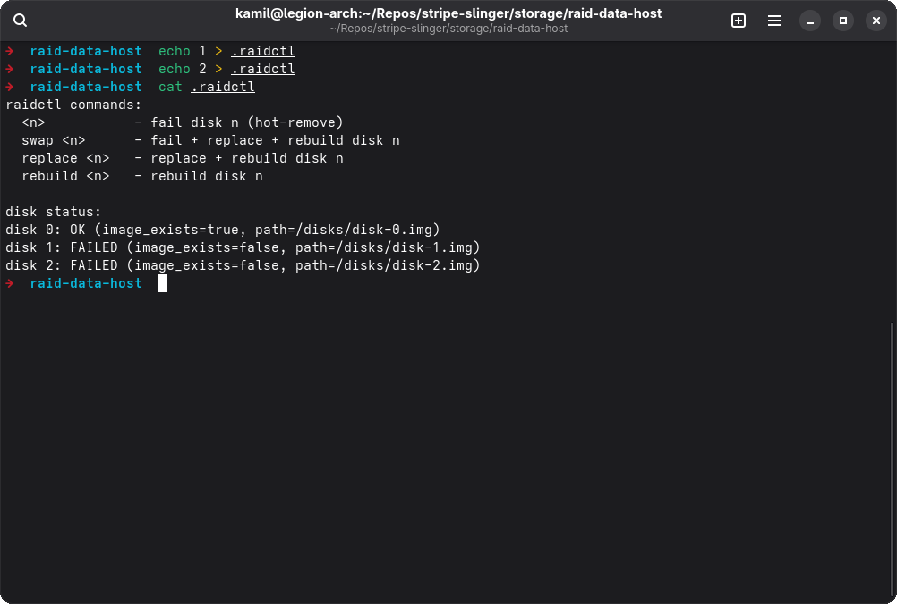
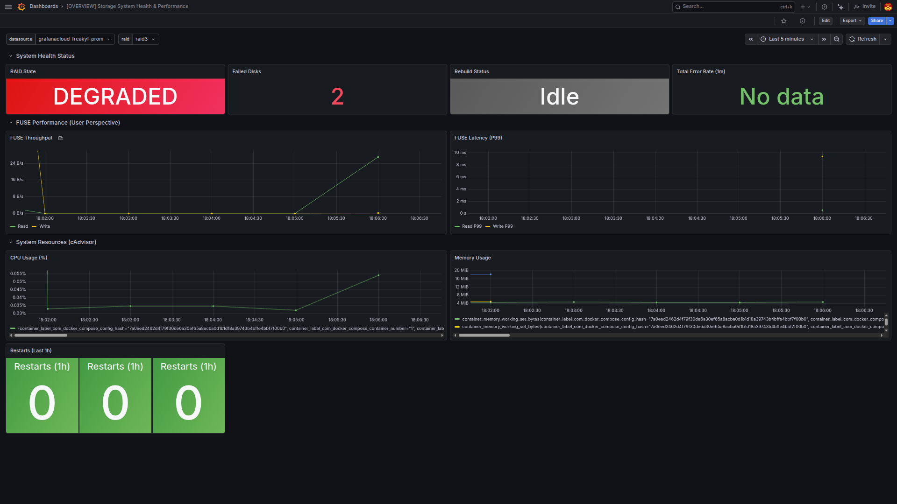
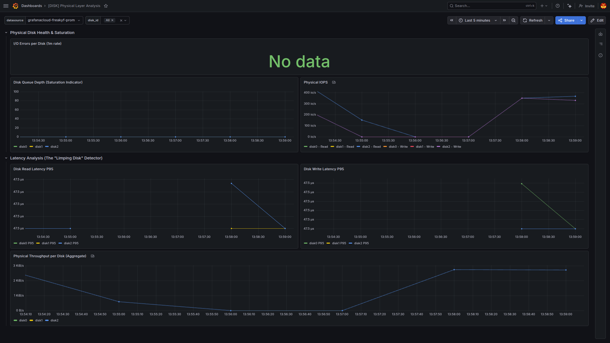
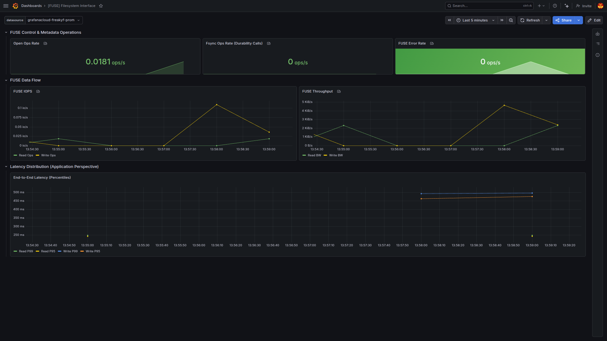
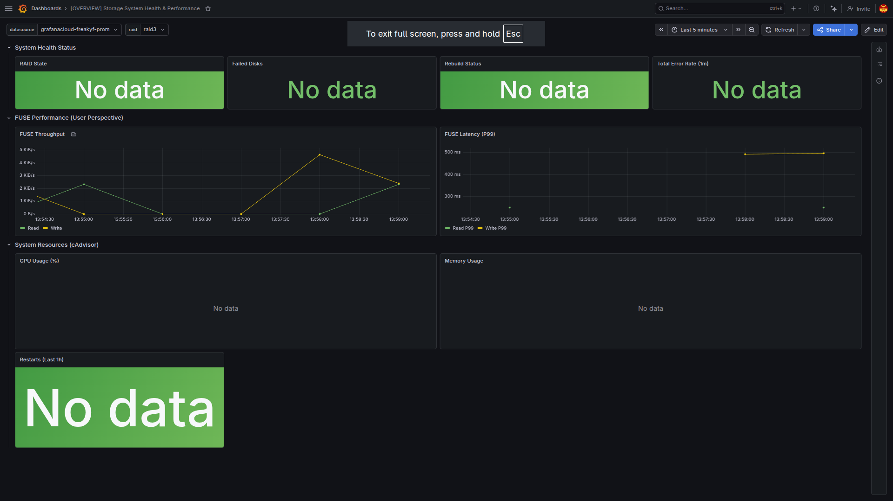
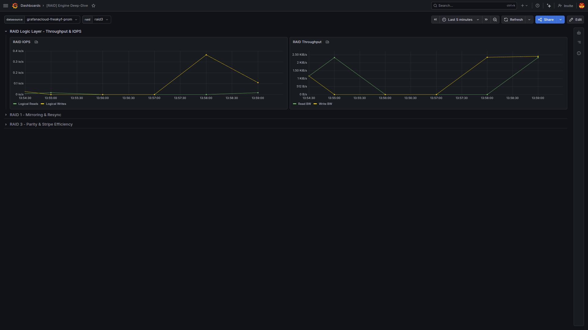

# Stripe Slinger

A user-space RAID simulator that mounts a FUSE-backed virtual block device and streams per-operation telemetry over gRPC to a Prometheus and Grafana observability stack.

## Overview

Stripe Slinger simulates RAID 0, 1 and 3 behaviour, including live disk failure and rebuild, without touching real block devices. A Rust FUSE filesystem stripes and mirrors data across disk images backed by memory-mapped files, then re-exports the mount over NFS so it behaves like an ordinary mounted volume. Every filesystem and RAID operation is streamed to a separate Go telemetry gateway, which exposes Prometheus metrics visualised in Grafana. The project was built as a university/portfolio project and is not currently under active development or deployed anywhere persistent.

## Scope

Stripe Slinger is a simulation and teaching environment, not a storage product. Disk images are regular files, not real block devices. The filesystem has a flat layout. It holds a single directory with up to 128 files and no subdirectories. RAID levels are limited to 0, 1 and 3, selected at mount time and fixed for the life of the mount.

## Features

- RAID 0, 1 and 3 striping through a shared `Stripe` layout trait, selected with `--raid` (or the `RAID_LEVEL` environment variable)
- Configurable disk count (1 to 8) and disk image size. RAID 0 additionally supports a single disk
- FUSE-mounted filesystem (via the `fuser` crate) backed by memory-mapped disk image files, with a flat table of up to 128 files
- A `.raidctl` control file in the mount root drives live failure injection. Writing a disk index hot-removes that disk, `replace <n>` and `swap <n>` replace and rebuild it, and `rebuild <n>` rebuilds it in place. Reading the file returns the command list and current disk status
- A background worker that rebuilds stripes for disks flagged as needing repair and reports rebuild progress through metrics
- FUSE, RAID and disk events are streamed asynchronously to the metrics gateway. The channel is bounded and drops batches under backpressure instead of blocking storage I/O
- Prometheus metrics for disk, RAID, FUSE and process-level activity, exposed over HTTP by the metrics gateway at `/metrics`
- Optional shared-secret authentication (`GRPC_AUTH_TOKEN`) on the gRPC stream between simulator and gateway
- Optional gRPC rate limiting on the gateway (`GRPC_RATELIMIT_RPS`, `GRPC_RATELIMIT_BURST`), enforced per request and per stream message
- A standalone synthetic metrics generator in both the Rust CLI (`raid-cli metrics`) and the Go gateway (`METRICS_ENABLE_SIMULATOR=true`), for exercising the telemetry pipeline without mounting a filesystem

## Tech stack

- **Languages:** Rust 1.91, 2024 edition (`raid-rs` engine, `raid-cli` FUSE binary), and Go 1.25 (`metrics-gateway`)
- **Rust:** fuser (FUSE bindings), memmap2, tokio, tonic and prost (gRPC), clap
- **Go:** google.golang.org/grpc, prometheus/client_golang, golang.org/x/time/rate
- **IPC:** gRPC over Unix domain sockets, service defined in `api/proto/metrics/v1/ingest.proto`
- **Observability:** Prometheus client metrics, Grafana Alloy for scraping and remote write, cAdvisor for container metrics, Grafana Cloud as the remote-write target
- **Infrastructure:** Docker Compose, Terraform (Grafana Cloud dashboards and alerts), GitLab CI

## Architecture

The system runs as two Docker containers plus an observability sidecar:



**raid-simulator** is split into two Rust crates. `raid-rs` holds the RAID striping math and the memory-mapped disk retention layer, with no FUSE dependency. `raid-cli` implements the FUSE filesystem on top of `raid-rs` using the `fuser` crate, and owns the metrics runtime that batches events and streams them to the gateway. The container mounts the filesystem with FUSE internally, then re-exports it over NFS on port 2049 so it can be mounted on the host (see the `mount` target in the Makefile).

**metrics-gateway** hosts a gRPC `MetricsIngestor` service on a Unix domain socket, updates Prometheus metric vectors from incoming batches, and serves them over HTTP at `/metrics` (with a `/healthz` liveness endpoint alongside it). It can optionally run its own synthetic load generator instead of receiving real events.

Grafana Alloy scrapes the gateway's `/metrics` endpoint and cAdvisor, then forwards everything to Grafana Cloud via remote write.

## Screenshots

**RAID control and disk geometry:**



**Global state dashboard while degraded:**



**Telemetry after a state reset:**




**Physical disk telemetry:**



**RAID logic layer telemetry:**



## Design notes

A few implementation choices the code makes worth calling out:

- FUSE integration goes through the `fuser` crate, which provides safe Rust bindings over the kernel FUSE protocol instead of raw C FFI to libfuse.
- The simulator and gateway talk gRPC over a Unix domain socket rather than TCP, since both processes run on the same host.
- Disk images are backed by memory-mapped files (`memmap2`), so the striping code reads and writes them as byte-addressable memory instead of managing explicit buffers.
- Logical-to-physical offset translation (`raid-rs/src/retention/volume/mapper.rs`) is a stateless arithmetic mapping built from division and modulo against fixed stripe and chunk sizes, rather than a lookup table.
- Metrics are best-effort. Events are pushed onto bounded channels with `try_send`, and a full channel drops the event instead of blocking the storage path.

## Testing

113 Rust unit tests across `raid-rs` and `raid-cli` (`cargo test`), and 28 Go tests in `metrics-gateway` (`go test ./...`). Both suites run in GitLab CI, gated separately from linting (`clippy` for Rust, `go vet` for Go) and quality/security-audit jobs.

## Project structure

```
services/raid-simulator/   Rust workspace: raid-rs (engine) + raid-cli (FUSE binary)
services/metrics-gateway/  Go telemetry gateway: gRPC ingest, Prometheus metrics, HTTP server
api/proto/                 Shared protobuf definitions (metrics.v1)
deploy/                    docker-compose.yml and the socket-directory bootstrap script
observability/             Grafana Alloy config and Grafana dashboards
provisioning/terraform/    Terraform for Grafana Cloud dashboards and alerts
docs/screenshots/          Screenshots referenced from this README
```

## Authors

**Kamil Fudala**

- [GitHub](https://github.com/FreakyF)
- [LinkedIn](https://www.linkedin.com/in/kamil-fudala/)

**Jan Chojnacki**

- [GitHub](https://github.com/Jan-Chojnacki)
- [LinkedIn](https://www.linkedin.com/in/jan-chojnacki-772b0530a/)

**Jakub Babiarski**

- [GitHub](https://github.com/JakubKross)
- [LinkedIn](https://www.linkedin.com/in/jakub-babiarski-751611304/)

## License

This project is licensed under the [MIT License](LICENSE).
